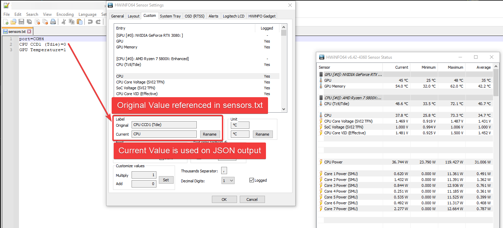

### Changelog:

- **1.0** - Initial release of a Serial version of RemoteHWInfo.

### About:
RemoteHWInfo HWiNFO Remote Monitor Serial Json App

### Setup:
The sensors.txt file is read at application startup and contains information regarding the neccesary COM Port along with the desired Sensor data you want. Modify the sensors.txt file with the following:
 * port=COMx
   *  Set the "COMx" value to COM Port assigned to the device e.g. COM4
 * SensorOriginalLabel=IntValueBeginningAt0
   *  This format will be the Original Label Value of your desired Sensor along with assigning a numerical value beginning from 0. This allows the ability to order which sensors appear in which order. 

The Label for the provided Sensor Data in the JSON output will be the value of the "Current" label for the Sensor.  This allows customizing the label output name to potentially reduce the size of the JSON output for longer Label names along with reducing overhead and code on the Microcontroller side.

#### Example File

* Specified Port is COM4
* 2 sensors will be picked up by the app which are "CPU CCD1 (Tdie)" and "GPU Temperature".
  * As many sensors as needed can be added 

### Usage:
Start it up with windows (Easily done with NSSM)

### Credits:

- Demion - Created the RemoteHWInfo project that this project heavily modifies https://github.com/Demion/remotehwinfo
